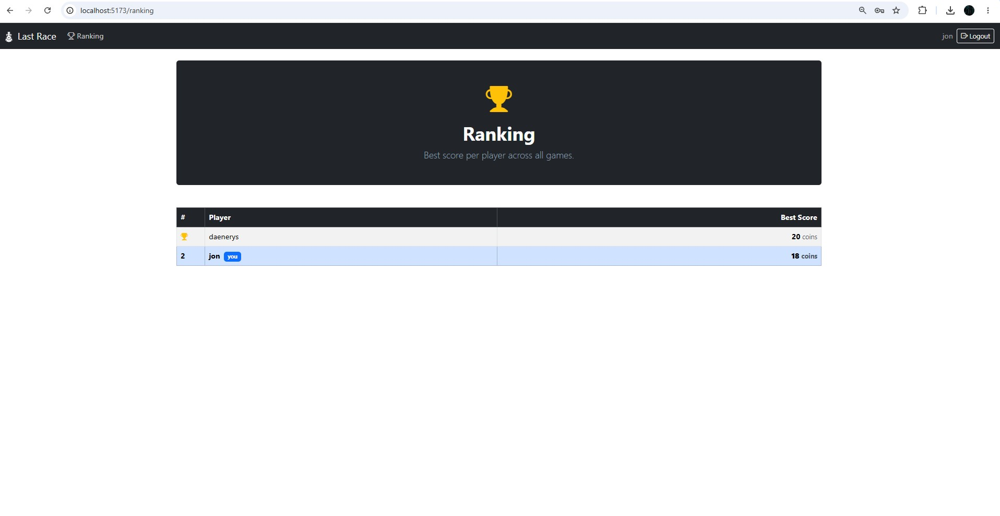
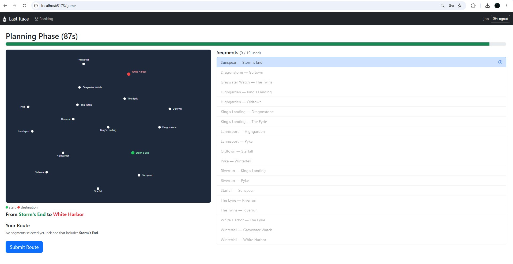

# Exam #1: "Last Race"
## Student: s358407 RIVANDI PEYMAN

## Getting Started

**Prerequisites:** Node.js 24.x LTS, `nodemon` installed globally.

```bash
# 1. Clone the repository
git clone <your-repo-url>
cd <project-folder>

# 2. Install dependencies
cd server && npm install
cd ../client && npm install

# 3. Start the server (in one terminal)
cd server
nodemon index.js

# 4. Start the client (in another terminal)
cd client
npm run dev
```

The server runs on `http://localhost:3001` and the client on `http://localhost:5173`.  
The database is created and seeded automatically on first server start.

## React Client Application Routes

- Route `/`: Home page with game lore and phase-by-phase instructions. Accessible to everyone; anonymous users see only the instructions without the network map.
- Route `/login`: Login form with username and password. Redirects to `/` if the user is already authenticated.
- Route `/game`: Full game flow (Setup → Planning → Execution → Result). Requires authentication; redirects to `/login` otherwise.
- Route `/ranking`: Leaderboard showing the best score per registered player, sorted descending. Requires authentication; redirects to `/login` otherwise.

## API Server

### Authentication

- POST `/api/sessions`
  - Login. Request body: `{ username, password }`
  - Response body: user object `{ id, username }`
  - Status: `200` on success, `401` if credentials are wrong, `500` on server error
- GET `/api/sessions/current`
  - Check the current session. No request parameters
  - Response body: current user object `{ id, username }`
  - Status: `200` if authenticated, `401` otherwise
- DELETE `/api/sessions/current`
  - Logout. No request parameters or body
  - Response body: empty
  - Status: `200`, destroys the session

### Network

- GET `/api/network`
  - Get all lines with their ordered stations (Setup phase map). No request parameters
  - Response body: array of line objects, each with `id, name, hex_color` and a `stations` array in stop order
  - Status: `200` on success, `401` if not authenticated, `500` on server error
- GET `/api/segments`
  - Get all adjacent station pairs without line info (Planning phase list). No request parameters
  - Response body: array of segment objects `{ from_id, from_name, to_id, to_name }`
  - Status: `200` on success, `401` if not authenticated, `500` on server error

### Game

- POST `/api/game/start`
  - Start a new game. No request body. Picks a random start and destination at least 3 segments apart (BFS) and stores them in the session
  - Response body: `{ start: { id, name }, destination: { id, name } }`
  - Status: `200` on success, `401` if not authenticated, `500` if no valid pair is found or on error
- POST `/api/game/submit`
  - Submit the built route. Request body: `{ route: [stationId, ...] }`
  - Validates the route (connectivity, no repeated segments, line-change rules at interchanges), fires one random event per segment, saves the score
  - Response body: `{ valid, score, events: [{ from_id, to_id, description, effect, coins_after }] }`. If the route is invalid or incomplete, `valid` is `false`, `score` is `0`, and `events` is empty
  - Status: `200` on success, `400` if no game is in progress, `401` if not authenticated, `422` if `route` is not an array, `500` on error
- GET `/api/ranking`
  - Get the best score per user. No request parameters
  - Response body: array of `{ username, best_score }` sorted by best score descending
  - Status: `200` on success, `401` if not authenticated, `500` on server error

## Database Tables

- Table `users` - contains registered users: `id`, `username`, `hash`, `salt` (passwords hashed with scrypt)
- Table `lines` - contains metro lines: `id`, `name`, `hex_color`
- Table `stations` - contains station names: `id`, `name`
- Table `line_stations` - junction table linking lines to stations with a `position` column that defines the stop order along each line
- Table `events` - contains random events: `id`, `description`, `effect` (integer from −4 to +4)
- Table `games` - contains completed games: `id`, `user_id`, `score`, `played_at`

## Main React Components

- `App` (in `App.jsx`): root component, manages authentication state, wraps routes, and renders the feedback toast
- `NavBar` (in `components/NavBar.jsx`): top navigation bar with page links and login/logout button
- `HomePage` (in `components/HomePage.jsx`): lore text, phase-by-phase instruction cards, and play/login call-to-action banner
- `LoginPage` (in `components/LoginPage.jsx`): username and password form, calls the login API and navigates to home on success
- `GamePage` (in `components/GamePage.jsx`): orchestrates the four game phases by managing phase state and calling the game APIs
- `SetupPhase` (in `components/game/SetupPhase.jsx`): displays the full network map; player clicks Ready to advance to Planning
- `PlanningPhase` (in `components/game/PlanningPhase.jsx`): 90-second countdown timer, segment list with color-coded availability, and route builder
- `ExecutionPhase` (in `components/game/ExecutionPhase.jsx`): steps through events one at a time, showing the effect and updated coin total per segment
- `NetworkMap` (in `components/game/NetworkMap.jsx`): reusable SVG map; renders full lines in Setup phase, stations only in Planning phase
- `RankingPage` (in `components/RankingPage.jsx`): fetches and displays the best-score leaderboard, highlights the current user's row

## Screenshots





## Users Credentials

- jon, snow (has pre-existing game history)
- daenerys, dragon (has pre-existing game history)
- tyrion, lannister

## Use of AI Tools

Claude Code was used as a coding assistant throughout the project. All generated code was reviewed, tested, and adjusted by me.

ChatGPT was used throughout the project for asking questions, generating station names based on my ideas, and generating the lore text on the home page.
